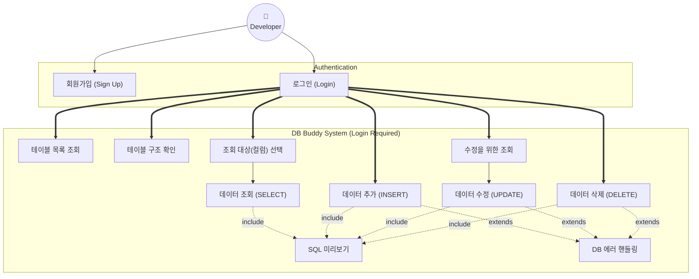
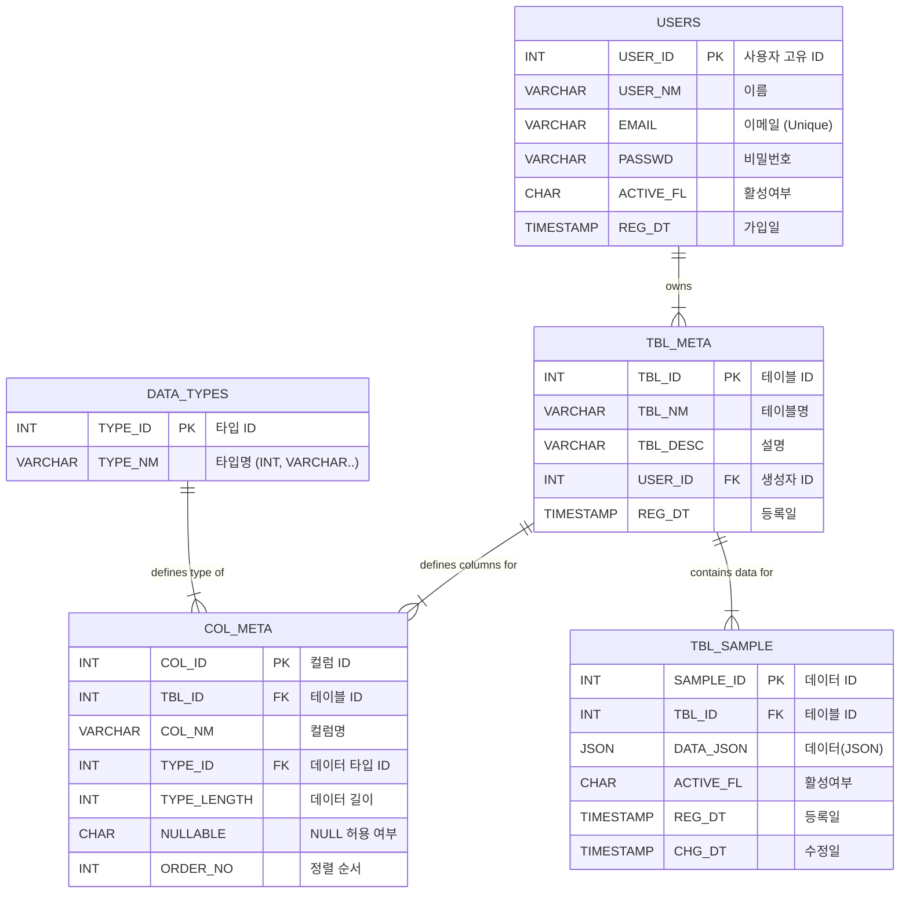
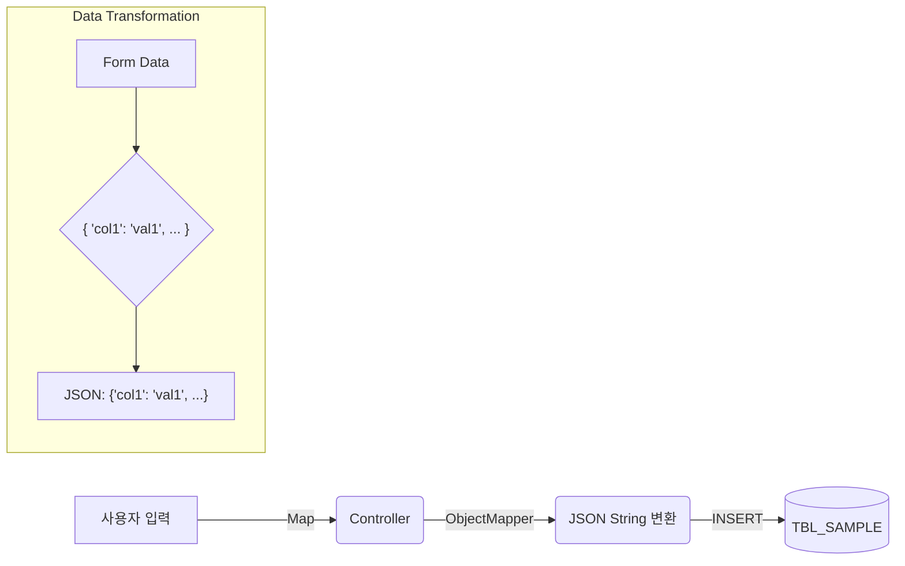
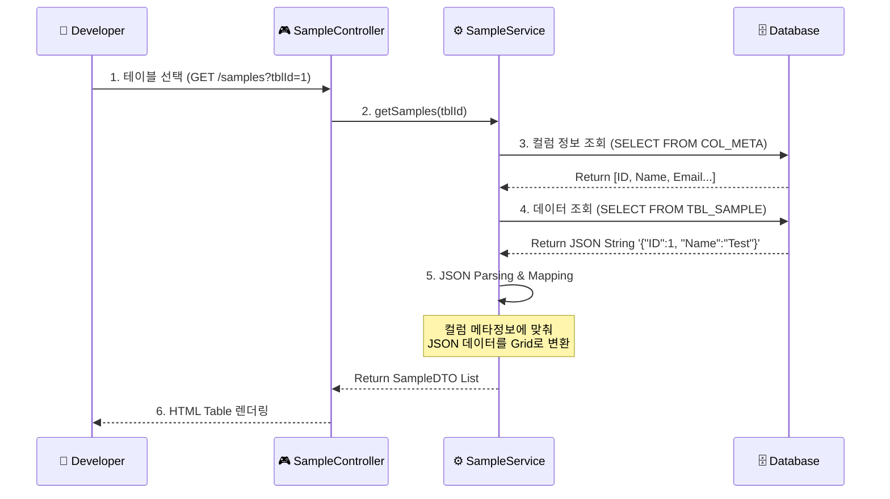
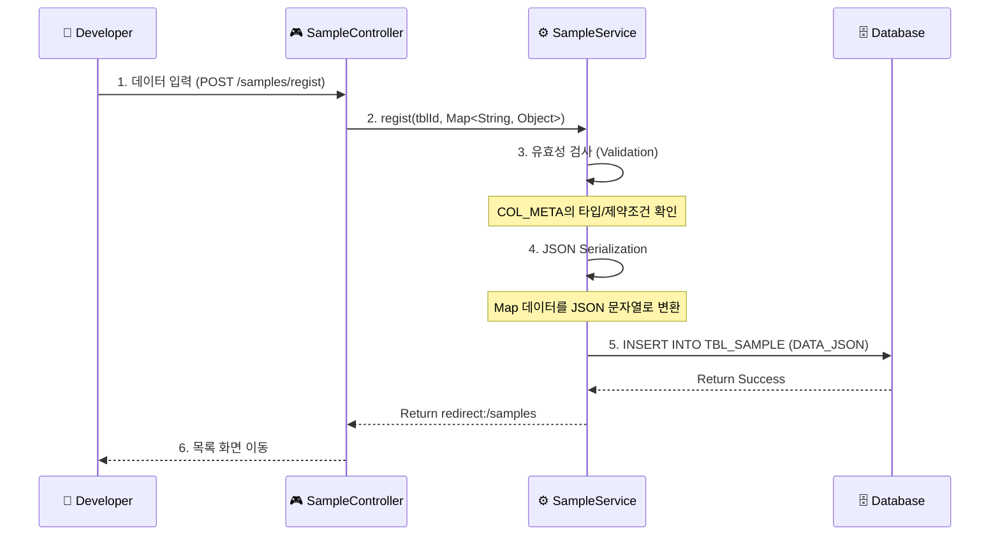

# 목차 (Table of Contents)
1. [프로젝트 소개](#-프로젝트-소개-project-introduction)
    - [1️⃣ 프로젝트 개요](#1️⃣-프로젝트-개요)
    - [2️⃣ 팀원 구성](#2️⃣-팀원-구성-team-composition)
    - [🛠️ 개발 환경](#�️-개발-환경-tech-stack)
2. [기획](#-기획-planning)
    - [3️⃣ 요구사항 상세](#3️⃣-요구사항-상세-requirements-specification)
    - [4️⃣ 시스템 설계](#4️⃣-시스템-설계)
        - [3.1 유스케이스](#31-유스케이스-use-case)
        - [3.2 ERD](#32-erd-entity-relationship-diagram)
        - [3.3 DDL](#33-ddl-data-definition-language)
        - [3.4 스키마 관리 흐름](#34-스키마-관리-흐름-schema-management-flow)
        - [3.5 데이터 처리 흐름](#35-데이터-처리-흐름-data-processing-flow)
3. [개발자 가이드](#-개발자-가이드-developer-guide)
    - [5️⃣ 프로젝트 진행 전략](#5️⃣-프로젝트-진행-전략)
    - [6️⃣ 트러블슈팅](#6️⃣-트러블슈팅-db-연결-문제-해결)

---

# �📌 프로젝트 소개 (Project Introduction)

## 프로젝트 이름
**DB Buddy**

---

## 1️⃣ 프로젝트 개요

**GUI 기반 CRUD 학습용 웹 DBMS**

이 프로젝트는 SQL 문을 직접 작성하지 않아도, 버튼과 입력폼을 통해 CRUD(Create, Read, Update, Delete)를 수행하고, 내부에서 어떤 SQL이 실행되는지 직관적으로 확인할 수 있는 교육용 웹 도구입니다.

- **목표**: SQL 문 구조와 DB 동작 원리를 직관적으로 이해
- **특징**: SQL 직접 입력 X / 안전한 범위 내 CRUD / GUI 기반

## 2️⃣ 팀원 구성 (Team Composition)

| 이름 | 역할 | GitHub | Email |
|:---:|:---:|:---:|:---:|
| **정진호** | **팀장** | [fdrn9999](https://github.com/fdrn9999) | [ckato9173@gmail.com](mailto:ckato9173@gmail.com) |
| **김태형** | 팀원 | [ikth-kim](https://github.com/ikth-kim) | [ikth.kim@gmail.com](mailto:ikth.kim@gmail.com) |
| **윤성원** | 팀원 | [SungWon180](https://github.com/SungWon180) | [yseongwon851@gmail.com](mailto:yseongwon851@gmail.com) |
| **정병진** | 팀원 | [wjdqudwls](https://github.com/wjdqudwls) | [wjdqdwls100@gmail.com](mailto:wjdqdwls100@gmail.com) |
| **최현지** | 팀원 | [choihyeonji00](https://github.com/choihyeonji00) | [as124ff2@gmail.com](mailto:as124ff2@gmail.com) |

## 🛠️ 개발 환경 (Tech Stack)

| 구분 | 상세 내용 |
|:---:|:---|
| **OS** | Windows |
| **Language** | Java 17 |
| **Framework** | Spring Boot 3.5.9 |
| **Build** | Gradle |
| **Database** | MariaDB |
| **ORM** | MyBatis 3.0.5 |
| **Frontend** | Thymeleaf, HTML5, CSS3, JavaScript |
| **Tool** | IntelliJ IDEA |

---

# 📌 기획 (Planning)

## 3️⃣ 요구사항 상세 (Requirements Specification)

### 3.1 기능 요구사항 (Functional Requirements)

시스템의 핵심 기능을 논리적 그룹으로 나누어 상세히 정의했습니다. 각 항목의 **[검증]** 기준은 QA 테스트의 Check-List로 활용됩니다.

#### 🏗️ 1. 회원 및 인증 (User & Authentication)
| ID | 구분 | 요구사항 명 | 상세 내용 및 검증 기준 (Acceptance Criteria) |
|:---:|:---:|:---|:---|
| **FR-101** | 가입 | **회원가입** | - 사용자 이름(2~20자), 이메일, 비밀번호(8자 이상)를 입력받아 계정을 생성한다.<br>- **[검증]** 이메일 형식(`@`) 미준수 시 "올바른 이메일 형식이 아닙니다" 에러 출력.<br>- **[검증]** 이미 가입된 이메일 입력 시 "이미 존재하는 계정입니다" 메시지로 차단. |
| **FR-102** | 인증 | **로그인** | - 이메일과 비밀번호가 DB와 일치해야만 세션(`JSESSIONID`)을 발급하고 접속을 허용한다.<br>- **[보안]** 로그인 실패 시 "아이디 또는 비밀번호를 확인해주세요"라는 모호한 메시지를 출력해야 한다(계정 존재 여부 유추 방지). |
| **FR-103** | 세션 | **로그아웃** | - 로그아웃 시 현재 세션을 즉시 만료시키고 로그인 페이지로 이동한다.<br>- **[검증]** 로그아웃 후 브라우저 '뒤로 가기' 버튼을 눌러도 보안 페이지에 접근할 수 없어야 한다. |

#### 🛠️ 2. 스키마 관리 (Schema Management)
| ID | 구분 | 요구사항 명 | 상세 내용 및 검증 기준 (Acceptance Criteria) |
|:---:|:---:|:---|:---|
| **FR-201** | 테이블 | **테이블 생성** | - 영문/숫자/언더바(`_`) 조합의 최대 50자 이름을 가진 테이블을 정의한다.<br>- **[검증]** 특수문자나 공백 입력 시 생성을 차단해야 한다.<br>- **[성공]** 생성된 테이블은 즉시 '내 테이블 목록'에 추가되어야 한다. |
| **FR-202** | 테이블 | **목록 조회** | - **[격리]** 로그인한 사용자가 생성한 테이블만 목록에 노출한다(타인 테이블 및 시스템 테이블 노출 금지).<br>- 테이블이 없을 경우 "생성된 테이블이 없습니다" 문구를 표시한다. |
| **FR-203** | 컬럼 | **컬럼 추가** | - 컬럼명, 데이터 타입, 길이, NULL 여부를 설정하여 추가한다.<br>- **[검증]** 데이터 타입은 시스템이 제공하는 목록(`DATA_TYPES`) 중에서만 선택 가능하다.<br>- **[UX]** `VARCHAR` 타입 선택 시에만 길이(`Length`) 입력 필드가 활성화되어야 한다. |
| **FR-204** | 컬럼 | **컬럼 수정** | - 기존 컬럼의 이름, 타입, 길이를 수정할 수 있다.<br>- **[주의]** 컬럼명 변경 시 기존 데이터와의 매핑이 끊길 수 있음을 사용자에게 경고(Alert)해야 한다. |
| **FR-205** | 컬럼 | **컬럼 삭제** | - 특정 컬럼을 메타 정보에서 영구적으로 제외한다.<br>- **[안전]** 삭제 전 "데이터 조회가 불가능해집니다"라는 확인(Confirm) 창을 반드시 띄워야 한다. |

#### 💾 3. 데이터 조작 (Data Manipulation)
| ID | 구분 | 요구사항 명 | 상세 내용 및 검증 기준 (Acceptance Criteria) |
|:---:|:---:|:---|:---|
| **FR-301** | 조회 | **데이터 조회** | - 선택한 테이블의 데이터를 페이징(10건 단위) 처리하여 조회한다.<br>- **[필터]** 체크박스로 선택된 컬럼만 그리드에 표시되어야 한다.<br>- **[성능]** 데이터 100건 조회 시 렌더링이 1초 이내에 완료되어야 한다. |
| **FR-302** | 입력 | **데이터 추가** | - 컬럼 메타정보에 맞춰 생성된 폼으로 데이터를 저장(`INSERT`)한다.<br>- **[검증]** `INT` 컬럼에 문자를 입력하거나 `VARCHAR` 길이를 초과하면 유효성 에러를 출력한다.<br>- **[타입]** `DATE` 타입은 달력(Date Picker) UI를 제공해야 한다. |
| **FR-303** | 수정 | **데이터 수정** | - 선택한 행(Row)의 데이터를 수정(`UPDATE`)한다.<br>- **[제약]** PK 역할을 하는 시스템 컬럼(`SAMPLE_ID`)은 수정할 수 없다(`readonly`). |
| **FR-304** | 삭제 | **데이터 삭제** | - 선택한 행을 삭제(`DELETE`)한다.<br>- **[안전]** 삭제 버튼 클릭 시 재확인(Confirm) 절차를 거쳐야 한다. |
| **FR-305** | 도구 | **SQL 미리보기** | - 사용자의 동작(CRUD)에 해당하는 SQL 쿼리를 화면 하단에 실시간으로 표시한다.<br>- **[형식]** `INSERT INTO [TABLE]...`와 같이 사용자가 이해하기 쉬운 논리적 SQL 형태로 변환하여 보여준다. |

### 3.2 비기능 요구사항 (Non-Functional Requirements)

시스템 품질, 보안, 운영 환경 등 기능 외적인 제약 사항을 상세히 기술합니다.

#### 🛡️ 1. 보안 (Security)
| ID | 구분 | 요구사항 명 | 상세 내용 및 기준 |
|:---:|:---:|:---|:---|
| **NFR-101** | 인증 | **강제 권한 제어** | - 모든 URL 접근은 서버(Interceptor)에서 로그인 여부를 검사해야 한다.<br>- 비로그인 접근 시 즉시 로그인 페이지로 리다이렉트한다. |
| **NFR-102** | 격리 | **데이터 프라이버시** | - SQL 실행 시 `WHERE USER_ID = ?` 조건을 강제하여 타인의 데이터 접근을 원천 차단한다.<br>- **[검증]** URL 파라미터 조작(`?tblId=Others`) 시 `403 Forbidden` 에러 발생. |
| **NFR-103** | 방어 | **Input Validation** | - XSS 방지를 위해 `<script>` 태그 입력을 이스케이핑 처리한다.<br>- SQL Injection 방지를 위해 반드시 MyBatis 파라미터 바인딩(`#{}`)을 사용한다. |

#### ⚡ 2. 사용성 및 성능 (Usability & Performance)
| ID | 구분 | 요구사항 명 | 상세 내용 및 기준 |
|:---:|:---:|:---|:---|
| **NFR-201** | UX | **시스템 피드백** | - 저장/수정 완료 시 Toast 팝업으로 결과를 명확히 알린다.<br>- 처리 시간이 1초 이상 소요될 경우 로딩(Spinner) 표시를 제공한다. |
| **NFR-202** | UX | **Friendly Error** | - DB 에러(중복 키, 제약조건 위반) 발생 시 원문(Stack Trace) 대신 "이미 존재하는 값입니다"와 같은 정제된 한글 메시지를 보여준다. |
| **NFR-203** | 호환성 | **반응형 웹** | - 데스크탑뿐만 아니라 모바일(360px~) 환경에서도 테이블과 폼이 깨지지 않고 정상 동작해야 한다. |

### 제한 사항
- **SQL 직접 입력 불가**: 사용자가 임의의 SQL을 작성하여 실행할 수 없다.
- **권한 제어**: 모든 기능(조회 포함)은 **로그인한 사용자만** 이용 가능하다. 비로그인 시 로그인 페이지로 강제 이동된다.

---

## 4️⃣ 시스템 설계

### 3.1 유스케이스 (Use Case)

개발자가 시스템을 통해 수행하는 기능을 요구사항 ID와 매핑하여 보여주는 다이어그램입니다.



### 3.2 ERD (Entity Relationship Diagram)

프로젝트에서 사용하는 데이터베이스 스키마 구조입니다. 메타데이터 기반으로 동적인 테이블 관리가 가능하도록 설계되었습니다.



### 3.3 DDL (Data Definition Language)

```sql
-- =========================================
-- Drop Tables (Reset Schema)
-- =========================================
DROP TABLE IF EXISTS TBL_SAMPLE;
DROP TABLE IF EXISTS COL_META;
DROP TABLE IF EXISTS TBL_META;
DROP TABLE IF EXISTS DATA_TYPES;
DROP TABLE IF EXISTS USERS;

-- =========================================
-- 1. Users Table
-- =========================================
CREATE TABLE USERS (
    USER_ID INT AUTO_INCREMENT PRIMARY KEY COMMENT '사용자 고유 ID',
    USER_NM VARCHAR(50) NOT NULL COMMENT '사용자 이름',
    EMAIL VARCHAR(100) NOT NULL UNIQUE COMMENT '사용자 이메일',
    PASSWD VARCHAR(100) NOT NULL COMMENT '암호화된 비밀번호',
    ACTIVE_FL CHAR(1) DEFAULT 'Y' COMMENT '활성 여부 (Y/N)',
    REG_DT TIMESTAMP DEFAULT CURRENT_TIMESTAMP COMMENT '가입일자',
    CONSTRAINT CK_USERS_ACTIVE_FL CHECK (ACTIVE_FL IN ('Y', 'N')),
    CONSTRAINT CK_USERS_EMAIL CHECK (EMAIL LIKE '%@%')
) ENGINE = InnoDB COMMENT = '사용자 테이블';

-- 2. Data Types Table
CREATE TABLE DATA_TYPES (
    TYPE_ID INT AUTO_INCREMENT PRIMARY KEY COMMENT '타입 고유 ID',
    TYPE_NM VARCHAR(50) NOT NULL UNIQUE COMMENT '데이터 타입 명',
    REG_DT TIMESTAMP DEFAULT CURRENT_TIMESTAMP COMMENT '등록일자'
) ENGINE = InnoDB COMMENT = '지원하는 DB 데이터 타입 정의';

INSERT INTO DATA_TYPES (TYPE_NM) VALUES ('INT'), ('VARCHAR'), ('TEXT'), ('DATE');

-- 3. Tables Metadata
CREATE TABLE TBL_META (
    TBL_ID INT AUTO_INCREMENT PRIMARY KEY COMMENT '테이블 고유 ID',
    TBL_NM VARCHAR(50) NOT NULL COMMENT '테이블 이름',
    TBL_DESC VARCHAR(255) COMMENT '테이블 설명',
    USER_ID INT NOT NULL COMMENT '생성자 ID(FK)',
    REG_DT TIMESTAMP DEFAULT CURRENT_TIMESTAMP COMMENT '등록일자',
    CONSTRAINT TBL_META_FK1 FOREIGN KEY (USER_ID) REFERENCES USERS (USER_ID) ON DELETE CASCADE
) ENGINE = InnoDB COMMENT = '테이블 메타 데이터';

-- 4. Columns Metadata
CREATE TABLE COL_META (
    COL_ID INT AUTO_INCREMENT PRIMARY KEY COMMENT '컬럼 고유 ID',
    TBL_ID INT NOT NULL COMMENT '테이블 ID(FK)',
    COL_NM VARCHAR(50) NOT NULL COMMENT '컬럼 이름',
    TYPE_ID INT NOT NULL COMMENT '데이터 타입 ID(FK)',
    TYPE_LENGTH INT DEFAULT 0 COMMENT '데이터 길이 (VARCHAR 등)',
    NULLABLE CHAR(1) DEFAULT 'Y' COMMENT 'NULL 허용 여부 (Y/N)',
    ORDER_NO INT DEFAULT 0 COMMENT '컬럼 순서',
    REG_DT TIMESTAMP DEFAULT CURRENT_TIMESTAMP COMMENT '등록일자',
    CONSTRAINT CK_COL_META_NULLABLE CHECK (NULLABLE IN ('Y', 'N')),
    CONSTRAINT COL_META_FK1 FOREIGN KEY (TBL_ID) REFERENCES TBL_META (TBL_ID) ON DELETE CASCADE,
    CONSTRAINT COL_META_FK2 FOREIGN KEY (TYPE_ID) REFERENCES DATA_TYPES (TYPE_ID) ON DELETE RESTRICT
) ENGINE = InnoDB COMMENT = '컬럼 메타 데이터';

-- 5. Sample Data Table
CREATE TABLE TBL_SAMPLE (
    SAMPLE_ID INT AUTO_INCREMENT PRIMARY KEY COMMENT '데이터 고유 ID',
    TBL_ID INT NOT NULL COMMENT '테이블 ID(FK)',
    DATA_JSON JSON NOT NULL COMMENT '컬럼-값 매핑(JSON)',
    ACTIVE_FL CHAR(1) DEFAULT 'Y' COMMENT '활성 여부 (Y/N)',
    REG_DT TIMESTAMP DEFAULT CURRENT_TIMESTAMP COMMENT '등록일자',
    CHG_DT TIMESTAMP DEFAULT CURRENT_TIMESTAMP ON UPDATE CURRENT_TIMESTAMP COMMENT '수정일자',
    CONSTRAINT CK_TBL_SAMPLE_ACTIVE_FL CHECK (ACTIVE_FL IN ('Y', 'N')),
    CONSTRAINT TBL_SAMPLE_FK1 FOREIGN KEY (TBL_ID) REFERENCES TBL_META (TBL_ID) ON DELETE CASCADE
) ENGINE = InnoDB COMMENT = '샘플 CRUD 학습용 데이터';

CREATE INDEX IDX_USERS_EMAIL ON USERS (EMAIL);
```

### 테이블 역할 설명

| 테이블 명 | 역할 설명 | 비고 |
|:---:|:---|:---|
| **USERS** | **사용자 관리**<br>로그인 및 권한 처리를 위한 사용자 정보를 저장합니다. | 회원가입/로그인 시 사용됨 |
| **DATA_TYPES** | **데이터 타입 정의**<br>시스템에서 지원하는 데이터 타입(INT, VARCHAR 등)을 관리합니다. | `COL_META`에서 참조하여 사용 (정규화) |
| **TBL_META** | **테이블 메타 정보**<br>사용자가 생성/관리하는 가상의 '테이블' 자체에 대한 정보(이름, 설명)를 정의합니다. | 시스템이 관리하는 '테이블 목록'의 원천 데이터 |
| **COL_META** | **컬럼 메타 정보**<br>각 테이블의 컬럼 구조를 정의하며, `DATA_TYPES`를 참조하여 타입을 지정합니다. | 동적 폼 생성 및 유효성 검사에 활용 |
| **TBL_SAMPLE** | **실제 데이터 저장소**<br>사용자가 입력한 데이터를 JSON 형태로 유연하게 저장합니다. | **Physical Schema-less 구현**<br>동적인 컬럼 구조를 수용하기 위해 `DATA_JSON`에 Key-Value 형태로 값을 저장함. |

> **💡 설계 의도 (Why JSON?)**
> 이 프로젝트는 사용자가 정의한 테이블과 컬럼 구조가 수시로 변경될 수 있는 **가상 DBMS환경**입니다.
> 매번 물리적인 `CREATE TABLE` / `ALTER TABLE`을 수행하는 대신, **메타데이터(`TBL_META`, `COL_META`)로 구조를 정의**하고 **실제 데이터는 `TBL_SAMPLE`의 JSON 컬럼에 유연하게 저장**하는 방식을 채택하여, 안전하고 유연한 스키마 관리를 구현했습니다.

### 3.4 스키마 관리 흐름 (Schema Management Flow)

> **⚠️ 아키텍처 핵심 (Core Architecture)**
> **"물리적 테이블은 변하지 않습니다."**
> 사용자가 화면에서 테이블을 생성하거나 컬럼을 수정하더라도, 실제 DB 내부에서는 **DDL(`CREATE`, `ALTER`, `DROP`)이 전혀 실행되지 않습니다.**

### 3.4 스키마 관리 흐름 (Schema Management Flow)

시스템은 `DDL` 대신 `INSERT`와 `UPDATE`만을 사용하여 테이블 구조 변경을 모사(Simulation)합니다.

- **사용자 관점**: "새로운 테이블 `Order`를 생성하자."
- **시스템 처리**: `INSERT INTO TBL_META (TBL_NM) VALUES ('Order');`
- **사용자 관점**: "`Order` 테이블에 `price` 컬럼을 추가하자."
- **시스템 처리**: `INSERT INTO COL_META (TBL_ID, COL_NM, TYPE_ID) VALUES (1, 'price', 2);`

---

### 3.5 데이터 처리 메커니즘 (Data Processing Mechanism)

사용자가 입력한 데이터가 어떻게 저장되고, 다시 조회되는지 핵심 흐름을 설명합니다. MariaDB의 `JSON` 타입과 함수를 적극 활용하여 NoSQL과 유사한 유연성을 확보했습니다.

#### 1. 데이터 저장 파이프라인 (Input Flow)

사용자가 동적으로 생성된 폼에서 데이터를 입력하고 저장할 때의 흐름입니다.



1.  **동적 폼**: `COL_META` 정보를 기반으로 생성된 `<input>` 태그들의 `name` 속성은 컬럼명(예: `product_name`)과 일치합니다.
2.  **데이터 바인딩**: Spring Controller는 이를 `Map<String, Object>` 형태로 유연하게 수신합니다 (별도의 DTO Class 생성 불필요).
3.  **JSON 직렬화**: Jackson 라이브러리의 `ObjectMapper`를 사용하여 Map을 JSON String으로 변환합니다.
4.  **저장**: 변환된 JSON String을 `TBL_SAMPLE` 테이블의 `DATA_JSON` 컬럼에 `INSERT` 합니다.

#### 2. 데이터 조회 및 필터링/정렬 전략 (Read Strategy)

물리적 컬럼이 없으므로, 표준 `WHERE` 절이나 `ORDER BY` 절을 직접 사용할 수 없습니다. 대신 관련 DBMS 함수를 사용합니다.

**A. 필터링 (Filtering)**
특정 키(`key`)의 값에 대해 조건을 걸기 위해 `JSON_VALUE` 함수를 사용합니다.
```sql
-- 예: 'price' 컬럼의 값이 1000 이상인 데이터 조회
SELECT * 
FROM TBL_SAMPLE 
WHERE JSON_VALUE(DATA_JSON, '$.price') >= 1000
```

**B. 정렬 (Sorting)**
마찬가지로 `JSON_VALUE`를 사용하여 정렬 기준을 추출합니다.
```sql
-- 예: 'created_at' 날짜 내림차순 정렬
SELECT * 
FROM TBL_SAMPLE 
ORDER BY JSON_VALUE(DATA_JSON, '$.created_at') DESC
LIMIT 10 OFFSET 0
```

> **💡 성능 고려사항**
> 대량의 데이터에 대해 `JSON_VALUE` 기반 정렬/필터링을 수행하면 Full Table Scan이 발생할 수 있습니다 (인덱스 미적용). 향후 성능 이슈 발생 시 [Generated Columns](https://mariadb.com/kb/en/generated-columns/)을 활용하여 특정 Key에 대한 가상 컬럼 및 인덱스를 생성하는 방안을 고려해야 합니다.
> 모든 구조 변경은 `TBL_META`와 `COL_META` 테이블에 **데이터(Row)를 `INSERT/UPDATE/DELETE`** 하는 방식으로 처리되는 **논리적 변경**입니다.

사용자 관점의 경험과 실제 내부 동작(Internal Mechanism)을 비교한 흐름입니다.

#### 0️⃣ 전제 조건: 로그인
- **로그인 전**: 어떤 테이블도 보이지 않으며, 모든 URL 접근이 차단됩니다.
- **로그인 후**: **"내가 만든 테이블"**만 관리할 수 있습니다.
- 👉 *"DB를 만진다"는 개념을 로그인 사용자 기준으로 명확히 분리합니다.*

#### 1️⃣ 테이블 생성 흐름 (CREATE TABLE)
- **🔹 사용자 화면 (User Action)**
    1. `[테이블 관리]` 메뉴 클릭
    2. `[새 테이블 생성]` 버튼 클릭 → 테이블 이름/설명 입력
    3. `[생성]` 버튼 클릭
- **🔹 사용자 경험 (User Experience)**
    - 테이블 목록에 새 테이블이 즉시 추가됨
    - *"이제 이 테이블에 컬럼을 추가할 수 있겠구나"*라고 인지
- **🔹 내부 동작 (Internal Mechanism)**
    - ❌ `CREATE TABLE` 실행 안 함
    - ⭕ **TBL_META에 INSERT**
      ```sql
      INSERT INTO TBL_META (TBL_NM, TBL_DESC, USER_ID)
      VALUES ('LEDGER', '가계부 테이블', 1);
      ```
    - **Point**: 실제 DB에 테이블을 만들지 않고, **"테이블처럼 보이게"** 만드는 정의 정보만 저장합니다.

#### 2️⃣ 컬럼 추가 흐름 (ADD COLUMN)
- **🔹 사용자 화면 (User Action)**
    1. 테이블 상세 화면 진입 → `[컬럼 관리]` 영역 확인
    2. `[컬럼 추가]` 버튼 클릭
    3. 컬럼명(`AMOUNT`), 타입(`INT`), NULL 여부 등 입력 → `[저장]`
- **🔹 사용자 경험 (User Experience)**
    - 컬럼 목록 Grid에 즉시 반영
    - 이후 데이터 입력 폼에 해당 컬럼이 자동으로 생겨남
- **🔹 내부 동작 (Internal Mechanism)**
    - ❌ `ALTER TABLE ADD COLUMN` 실행 안 함
    - ⭕ **COL_META에 INSERT**
      ```sql
      INSERT INTO COL_META (TBL_ID, COL_NM, DATA_TYPE, NULLABLE, ORDER_NO)
      VALUES (1, 'AMOUNT', 'INT', 'N', 3);
      ```
    - **Point**: 이 순간부터 조회/입력/수정 화면이 이 컬럼 정보를 읽어 **자동으로 렌더링**됩니다.

#### 3️⃣ 컬럼 조회 흐름 (DESCRIBE TABLE)
- **🔹 사용자 화면 (User Action)**
    - 테이블 클릭만 하면 컬럼명, 타입, PK 여부 등이 자동으로 보임
- **🔹 내부 동작 (Internal Mechanism)**
    ```sql
    SELECT COL_NM, DATA_TYPE, NULLABLE, ORDER_NO
    FROM COL_META
    WHERE TBL_ID = ?
    ORDER BY ORDER_NO;
    ```
    - 👉 사용자는 *"이 테이블 구조가 이렇게 생겼구나"*를 SQL 없이 시각적으로 이해합니다.

#### 4️⃣ 컬럼 수정 흐름 (MODIFY COLUMN)
- **🔹 사용자 화면 (User Action)**
    1. 컬럼 목록에서 `[수정]` 버튼 클릭
    2. 이름/타입/순서 변경 → `[저장]`
- **🔹 사용자 경험 (User Experience)**
    - 컬럼 정보가 즉시 반영되고, 데이터 입력 폼 구조도 변경됨
- **🔹 내부 동작 (Internal Mechanism)**
    - ❌ `ALTER TABLE MODIFY COLUMN` 실행 안 함
    - ⭕ **COL_META UPDATE**
      ```sql
      UPDATE COL_META
      SET COL_NM = 'TOTAL_AMOUNT', NULLABLE = 'Y'
      WHERE COL_ID = 5;
      ```
    - **Point**: 이미 저장된 데이터(JSON)는 건드리지 않고, **화면 렌더링 기준(Meta)**만 변경합니다. (논리 스키마 변경 체험)

#### 5️⃣ 컬럼 삭제 흐름 (DROP COLUMN)
- **🔹 사용자 화면 (User Action)**
    1. `[삭제]` 클릭 → *"정말 삭제하시겠습니까?"* 확인
    2. 확인 시 삭제됨
- **🔹 사용자 경험 (User Experience)**
    - 컬럼이 목록에서 사라지고, 조회/입력 화면에서도 더 이상 보이지 않음
- **🔹 내부 동작 (Internal Mechanism)**
    - ❌ `ALTER TABLE DROP COLUMN` 실행 안 함
    - ⭕ **COL_META DELETE**
      ```sql
      DELETE FROM COL_META WHERE COL_ID = 7;
      ```
    - **Point**: 데이터(JSON)에는 해당 Key가 남아있을 수 있지만, 메타 정보가 사라졌으므로 시스템은 해당 데이터를 **"없는 취급"**합니다 (논리적 삭제).

#### 6️⃣ 요약 (Summary)
> **로그인** → **테이블 정의(TBL_META)** → **컬럼 정의(COL_META)** → **메타 기준 화면 자동 생성**

사용자는 끝까지 **SQL을 한 줄도 쓰지 않고**, 테이블과 컬럼을 직접 설계하는 경험을 하며, **DB 구조 변경이 시스템에 미치는 영향**을 눈으로 직접 확인하게 됩니다.

### 3.5 데이터 처리 흐름 (Data Processing Flow)

핵심 기능인 **동적 테이블 조회**와 **데이터 저장**이 내부적으로 어떻게 동작하는지 보여주는 흐름도입니다.

#### A. 동적 데이터 조회 (Dynamic Data Retrieval)
사용자가 테이블을 선택했을 때, 메타데이터와 JSON 데이터를 결합하여 화면을 구성하는 과정입니다.



#### B. 데이터 저장 (JSON Storage)
사용자가 입력한 Form 데이터가 JSON으로 변환되어 저장되는 과정입니다.


> **📝 저장되는 JSON 데이터 예시 (Example Data)**
> 사용자가 '가계부(Ledger)' 테이블에 데이터를 입력했을 때, `TBL_SAMPLE`의 `DATA_JSON` 컬럼에는 아래와 같이 저장됩니다.
> ```json
> {
>   "TRANS_DT": "2024-05-01",
>   "CATEGORY": "식비",
>   "AMOUNT": 12000,
>   "CONTENT": "점심 식사 (김치찌개)",
>   "METHOD": "카드"
> }
> ```
> *`TBL_META`에 정의된 컬럼명(Key)과 사용자 입력값(Value)이 매핑되어 저장됩니다.*

---

# 📌 개발자 가이드 (Developer Guide)


---

## 5️⃣ 프로젝트 진행 전략

1. 팀장이 전체 구조 설계 및 초기 API 구현
2. DB 담당이 테이블과 샘플 데이터 준비
3. UI 담당이 컬럼 체크박스 및 SELECT 미리보기 구현
4. CRUD 담당이 Create/Update/Delete 폼 제작
5. 팀장 통합 테스트 및 최종 검증

---

## 6️⃣ 트러블슈팅 (DB 연결 문제 해결)

애플리케이션 실행 시 DB 연결 권한 오류(`Access denied`, `DROP command denied`)가 발생할 경우, 아래 SQL을 **ROOT 계정**으로 실행하여 사용자를 생성하고 권한을 부여하세요.

```sql
-- 1. 사용자 생성 (localhost 전용)
CREATE USER IF NOT EXISTS 'swcamp'@'localhost' IDENTIFIED BY 'swcamp';

-- 2. 권한 부여 (모든 권한)
GRANT ALL PRIVILEGES ON GUI_CRUD_DBMS.* TO 'swcamp'@'localhost';

-- 3. 권한 적용
FLUSH PRIVILEGES;
```
